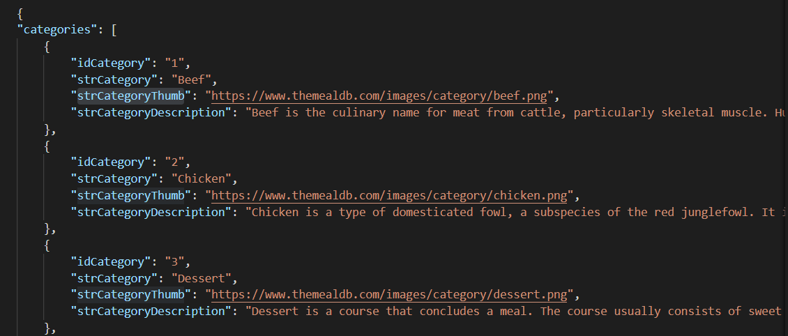
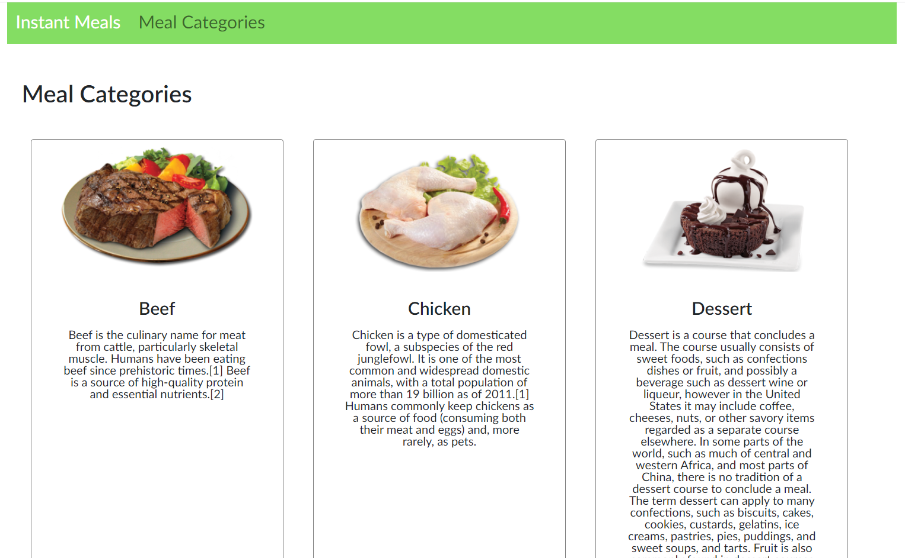

# Here is a list of project deliverables: 


1. Use create-react-app to bootstrap your project

* Verified from my package.json file: 

```"scripts": {  
    "start": "react-scripts start",  
    "build": "react-scripts build",
    "test": "react-scripts test",
    "eject": "react-scripts eject"
  },
```


2. Use a data source of your own choosing in JSON format that has lists of JavaScript objects within it (feel free to use the JSON sample files I've posted in Canvas)

* I connected my Postman app to themealdb.com API to retrieve a data source in JSON format with lists of JavaScript objects. I then added these JavaScript objects to a JSON file in my project.  




3. At least 2 React custom components and display them on your main page

* I created custom components called MealCategories and MealCard to display data on my main page

4. At least one custom component should be a "parent" of another functional React component

* I pass the child React component, MealCard, into the parent component, MealCategories: 


``` 

const MealCategories = () => {


const mealCats = theCategories.categories


const [mealData] = useState({
    mealList: mealCats
})

 


return (
<>


<main>
<h1 className="m-c-header">Meal Categories</h1>


<Container className="containerAll">
  
{mealData.mealList.map((mCategories) => {
    return (

        <MealCard
        strCategoryThumb={mCategories.strCategoryThumb}
        strCategory={mCategories.strCategory} 
        strCategoryDescription={mCategories.strCategoryDescription}
        />

    )
    
})}

</Container>
</main>

</>
)


}


export default MealCategories 

```


5. At least one other custom component should be a "child" React component

* The MealCard component is my child React component:

``` 

const MealCard = (props) => {

const {strCategoryThumb, strCategory, strCategoryDescription} = props

return (
<>


<main>

<Container className="containerAll">
        <Card className="meal-category-card">
        <figure className="cardImage">
  <Card.Img variant="top" src={`${strCategoryThumb}`} />
  </figure>
  <Card.Body className="cardInfo">
    <Card.Title className="cardTitle">{strCategory}</Card.Title>
    <Card.Text className="cardText">
      {strCategoryDescription}
    </Card.Text>
  </Card.Body>
</Card>
</Container>
</main>

</>
)


}


export default MealCard

```


6. Use the import keyword to bring your JSON data into your component files

`import theCategories from '../../data/meals.json'`


7. Use the import keyword to add your components to your App.js file (and be sure to export the component properly!)

* Code in my App.js file: 

```
import React from 'react';
import { BrowserRouter as Router, Route} from 'react-router-dom'
import MealCategories from './Components/MealCategories/MealCategories';
import NavBar from './Components/NavBar/NavBar';
import Footer from './Components/Footer/Footer'; 
import 'react-bootstrap';
import 'bootstrap/dist/css/bootstrap.css';
import './css/mealsStyles.css'; 


function App() {
  return (
   <>
   <Router>
     <NavBar />
  <Route path="/MealCategories" exact component={MealCategories} />
   <Footer />
   </Router>
   </>
  );
}

export default App;


```


8. Make sure each component can properly render some list of JSON object properties (style the output as you see fit)

* I use the .map method to render a list with next generation JavaScript and JSON object properties. 


``` 


const MealCategories = () => {


const mealCats = theCategories.categories


const [mealData] = useState({
    mealList: mealCats
})

 


return (
<>


<main>
<h1 className="m-c-header">Meal Categories</h1>


<Container className="containerAll">
  
{mealData.mealList.map((mCategories) => {
    return (

        <MealCard
        strCategoryThumb={mCategories.strCategoryThumb}
        strCategory={mCategories.strCategory} 
        strCategoryDescription={mCategories.strCategoryDescription}
        />

    )
    
})}

</Container>
</main>

</>
)


}


export default MealCategories 

```

*** A part of the list styled by React Bootstrap styling library




9. Demonstrate next generation JavaScript usage in your components including new operators and array methods

* Next generation JavaScript Array Method example in the MealCategories.js file: 


``` 

const MealCategories = () => {


return (

)

}

export default MealCategories 

```


10. Commit and push your source files into a Git repository named something like "initial-react-app"

* This is the Git repository for the first-react-app


11. Be sure your repo includes a ReadMe.md file.  Inside that ReadMe file use Markdown notation to list the features of your app (not the default ReadMe create-react-app provides)

* This is the ReadMe file to demonstrate a list of features in my app


12. Here is the link to the deployed app using Netlify: 


[Netlify link](https://first-react-meals-app.netlify.app/)